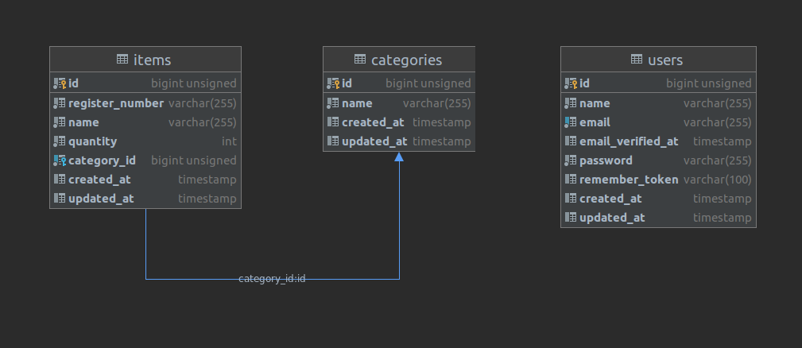

<p align="center"><a href="https://laravel.com" target="_blank">
</a></p>
<p align="center">
    Presentación Proyecto Tessi
</p>

## Diagrama Entidad Relación


## Comandos para ejecución

```
    // Instalación de paquetes
    composer install
    
    // Creación de archivo de entorno
    php -r "file_exists('.env') || copy('.env.example', '.env');"
    
    // Creación de key
    php artisan key:generate --ansi
    
    // Ejecución de migraciones y seeders
    php artisan migrate:fresh --seed
    
    // Puesta en marcha
    php artisan serve
```

## Entregables

- Autenticación básica de Laravel (punto 1)
- Migraciones y seeders del MER propuesto (puntos 2 / 3 / 4 / 5)
- Creación de módulos Categorías & Artículos para su listado y edición (puntos 6 / 7)
